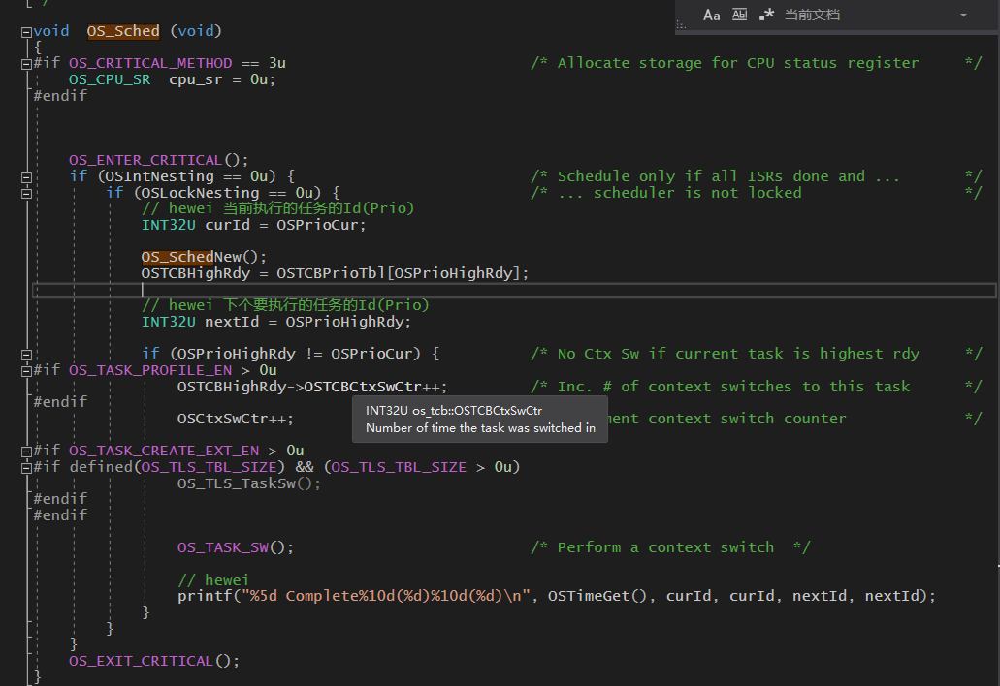
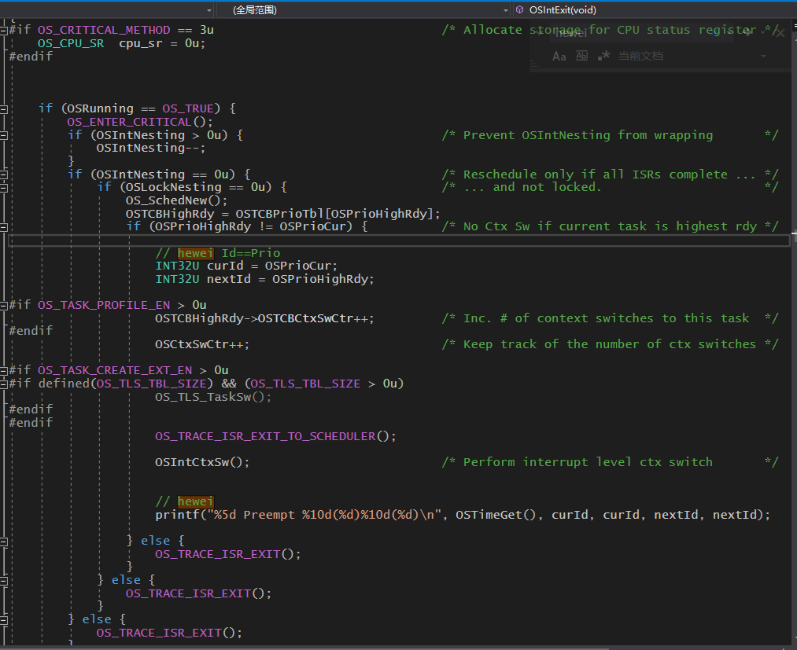
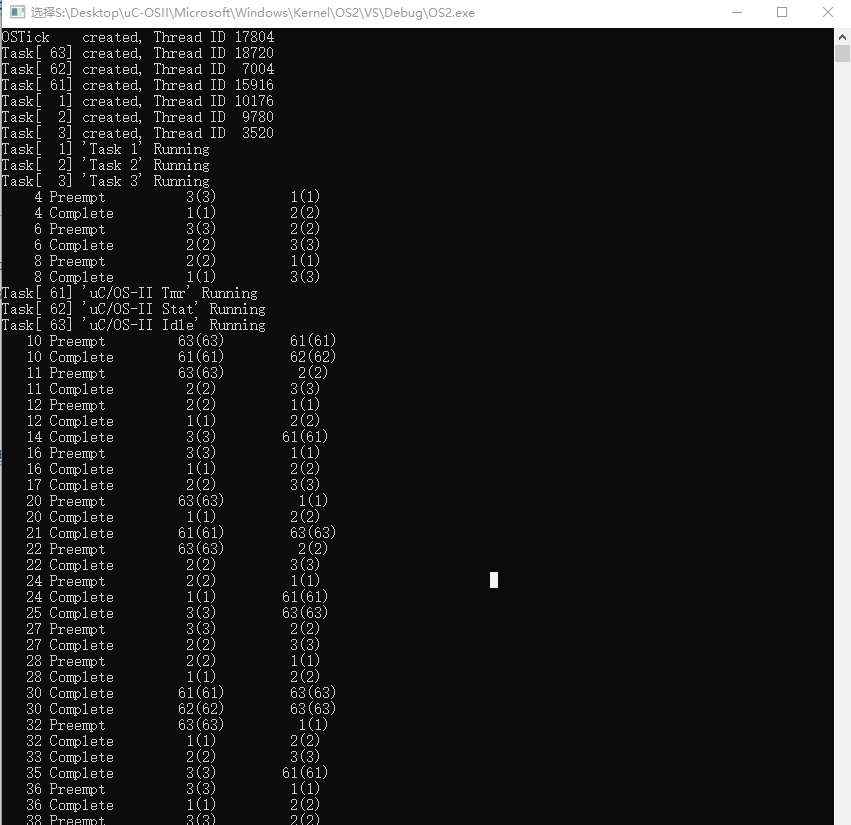
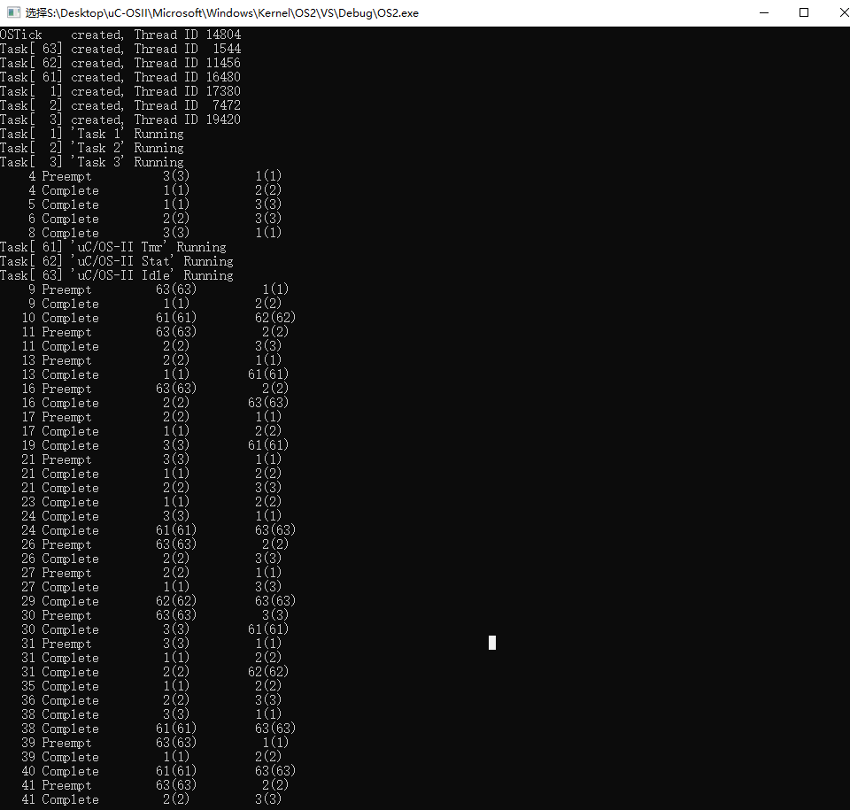

# 嵌入式实验---uC/OS-II多任务

191250044 贺伟

[实验源代码](https://github.com/hewei-nju/Multi-Task-Lab)

## 1. 实验目的

在uC/OS-II上进行多任务调度实验，详见MoodlePDF。

## 2. 实验内容

在uC/OS-II的VS移植版本上进行三个任务的调度，分两种情况：

* 三个任务之间没有相关性；
* 最高优先级和最低优先级任务存在数据共享；

## 3. 实验准备

### 1. 如何解决周期性任务的仿真问题？

* 通过无限循环 + 任务延期来仿真周期性任务的执行；表示如下：

```c
void TaskN(void *args)
{
	args = args;								// 避免警告
	int start;
	int end;
	int delay;

	while (DEF_ON) {
		start = OSTimeGet();
		while (OSTCBCur->compTime > 0) {}
		end = OSTimeGet();
		delay = OSTCBCur->period - (end - start);
		delay = delay >= 0 ? delay : 0;
		OSTCBCur->start += OSTCBCur->period;	// 任务下次开始的时间为本次开始的上次开始的时间 + 周期
		OSTCBCur->compTime = OSTCBCur->cost;
		OSTimeDly(delay);
	}
}
```

### 2. 如何解决任务之间存在数据共享问题？

* 通过uC/OS-II提供的信号量来实现任务执行过程中，临界区的数据访问唯一性。
* 采用C/C++的条件表一方式来实现实验中要求的两种情况，表示如下：

```c
void TaskN(void *args)
{
    ...
	while (DEF_ON) {
#ifdef ENABLE_DATA_SHARE			// 根据该宏是否被定义来选择是否允许数据共享
		OSSemPend(sem, 0, &err);
#endif
		...
#ifdef ENABLE_DATA_SHARE
		OSSemPost(sem);
#endif
		OSTimeDly(delay);
	}
}
```

### 3. 采用何种调度算法？

* 根据实验要求，**采用RMS调度算法**。任务的优先级固定，在实验中表现为根据任务的周期长短，在创建任务时，手动添加任务优先级。

实验要求任务集为：

```
Task Set {t1(1, 4), t2(2, 5), t3(2, 10)}	// 运行时间	周期
```

故优先级t1 > t2 > t3，在代码中体现为数字prio1 < prio2 < prio3。

又因为我们为了仿真周期任务的执行，后期会需要通过扩展OS_TCB，因此采用OSTaskCreateExt函数来创建任务，所以不妨令任务优先级 = 任务号。

t1, t2, t3分别为1，2，3.

## 3. 实验过程

**说明**：实验中的所修改的地方我均添加了注释`// hewei`，通过在源文件中搜索`hewei`能快速定位代码添加/修改的地方。

### 1. 根据周期性任务仿真要求，对OS_TCB结构体内容进行扩展

**具体操作**：对ucos_ii.h中的结构体struct os_tcb中添加如下内容：

```c
typedef struct os_tcb {
	// hewei
	INT32U start;		// 任务执行的开始时间
	INT32U cost;		// 任务执行所需要的时间
	INT32U period;		// 任务执行的周期
	INT32U compTime;	// 执行完本次任务所需要的时间

	....				// 原有的数据
} OS_TCB;
```
**为了能够在os_core.c中的OS_TCBInit中对OS_TCB扩展内容进行初始化，以及利用OSTaskCreateExt中的pext指针参数，在ucos_ii.h中添加如下结构体内容**：

```c
// hewei
typedef struct tcb_ext_data {
	INT32U start;		// 任务执行的开始时间
	INT32U cost;		// 任务执行所需要的时间
	INT32U period;		// 任务执行的周期
	INT32U compTime;	// 执行完本次任务所需要的时间
} TCB_EXT_DATA;
```
### 2. 任务的创建，采用OSTaskCreateExt函数进行，并使用pext指针对OS_TCB进行扩展

```c
	// task_data为TCB_EXT_DATA的结构体数组，目的是初始化OS_TCB的扩展内容
	tasks_data[0].cost = 1;
	tasks_data[0].period = 4;
	tasks_data[0].start = 0;
	tasks_data[0].compTime = 1;

	OSTaskCreateExt(
		Task1,
		NULL,
		&TaskStks[0][TASK_STK_SIZE - 1],		// 构建的任务栈栈顶
		1,										// 优先级
		1,										// 任务号
		&TaskStks[0][0],						// 构建的任务栈栈底
		TASK_STK_SIZE,							// 任务栈大小
		&tasks_data[0],							// os_tcb结构体扩展初始化数据指针
		0
		);
	OSTaskNameSet(1, "Task 1", &os_err);
```

### 3. 初始化OS_TCB扩展内容

**利用OSTaskCreateExt函数中传来的pext指针对os_tcb结构体进行扩展初始化，在os_core.c中的OS_TCBInit中添加如下内容**：

```c
INT8U  OS_TCBInit (INT8U    prio,
                   OS_STK  *ptos,
                   OS_STK  *pbos,
                   INT16U   id,
                   INT32U   stk_size,
                   void    *pext,
                   INT16U   opt)
{
		.....
        ptcb->OSTCBDly           = 0u;                     /* Task is not delayed                      */

		// hewei 通过pext作为tcb扩展的指针，来初始化在os_tcb中添加的内容
		if (pext != NULL) {
			ptcb->cost = ((TCB_EXT_DATA*)pext)->cost;
			ptcb->period = ((TCB_EXT_DATA*)pext)->period;
			ptcb->start = ((TCB_EXT_DATA*)pext)->start;
			ptcb->compTime = ((TCB_EXT_DATA*)pext)->compTime;
		}
		....
}
```
### 4. 周期性任务的仿真

**以Task 1为例**：

```c
void Task1(void *args)
{
	args = args;								// 避免警告
	int start;
	int end;
	int delay;
	while (DEF_ON) {
		start = OSTimeGet();
		while (OSTCBCur->compTime > 0) {}
		end = OSTimeGet();
		delay = OSTCBCur->period - (end - start);
		delay = delay >= 0 ? delay : 0;
		OSTCBCur->start += OSTCBCur->period;	// 任务下次开始的时间为本次开始的上次开始的时间 + 周期
		OSTCBCur->compTime = OSTCBCur->cost;
		OSTimeDly(delay);
	}
}
```

### 5. 模拟任务的执行，在os_core.c的OSTimeTick中添加如下内容

```c
void  OSTimeTick (void)
{	...
    { ...
        {
		 ...
		// hewei
		if (OSTCBCur->compTime > 0) {
			OSTCBCur->compTime -= 1;
		}
    }
}
```

### 6. 为了在任务完成和调度时，打印相应的任务变换情况，在os_core.c中的OS_Sched和OSIntExit中添加如下内容：





### 7. 为了实现最高优先级和最低优先级任务之间存在数据共享的情况，使用信号量，具体表现如下：

**信号量的创建**：

```c
// 如果当前是允许数据共享，则需要创建信号量
// 因为只区分两个任务，故信号量初始值为1即可

    OSInit();   

#ifdef ENABLE_DATA_SHARE
	sem = OSSemCreate(1);		// OS_EVENT *OSSemCreate(INT16U cnt)
#endif
```

> * 小坑：信号量必须在OSInit函数执行后创建，否则会出现写入错误。
> * 原因：其实现在想想很简单，信号量本身就是操作系统资源，操作系统尚未初始化，如何申请信号量呢！
> * 为什么创建信号量传入1，因为2^1 = 2，采用0-1模式.

**以Task 1为例，Task 3同理**：

```c
void Task1(void *args)
{
	args = args;								// 避免警告
	int start;
	int end;
	int delay;

	while (DEF_ON) {
#ifdef ENABLE_DATA_SHARE
		OSSemPend(sem, 0, &err);
#endif
		start = OSTimeGet();
		while (OSTCBCur->compTime > 0) {}
		end = OSTimeGet();
		delay = OSTCBCur->period - (end - start);
		delay = delay >= 0 ? delay : 0;
		OSTCBCur->start += OSTCBCur->period;	// 任务下次开始的时间为本次开始的上次开始的时间 + 周期
		OSTCBCur->compTime = OSTCBCur->cost;
#ifdef ENABLE_DATA_SHARE
		OSSemPost(sem);
#endif
		OSTimeDly(delay);
	}
}
```

## 4. 实验结果

**注意**：仔细对比两次结果的差异！

### 1. 任务之间相互独立



### 2. 最高优先级任务和最低优先级任务存在数据共享的情况

* 注意：执行时定义宏`ENABLE_DATA_SHARE`.

